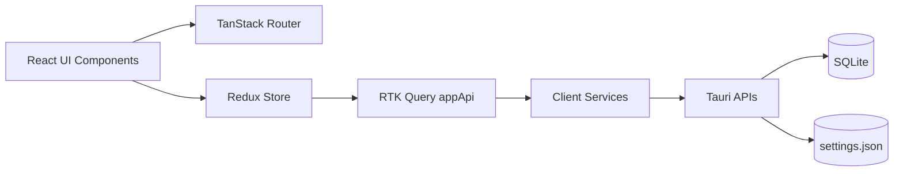

# Architecture

## Runtime flow

## Key principles

- UI should not directly own persisted app state.
- Persisted state operations should be represented as RTK Query endpoints.
- Styling should resolve from semantic tokens.
- New features should be isolated and testable by layer.

## Boundaries

### UI layer

- Lives in `src/components`, `src/layout`
- Calls hooks/selectors, dispatches actions
- Avoids direct persistence APIs

### State layer

- Lives in `src/store`
- Contains selectors, slices, endpoints
- Owns cache and mutation orchestration

### Services layer

- Lives in `src/services`
- Adapters for Tauri Store and SQLite

### Host layer

- Lives in `src-tauri`
- Rust commands and migrations

## Route model

Routes are currently centralized in `src/router.tsx` and rendered inside `EditorLayout`.

Primary routes:

- `/`
- `/files/$fileId`

## Editor model

- Title editor and page editor are separate TipTap instances.
- Extension registration is explicit in editor setup files.
- Print/export path:
  1. editor JSON/markdown -> HTML blocks (`src/utils/print.ts`)
  2. blocks + theme snapshot -> worker payload
  3. worker renders PDF (`src/workers/pdf.worker.tsx`)

## Migration note

Context imports remain available as wrappers to reduce churn, but they are backed by Redux store hooks.
